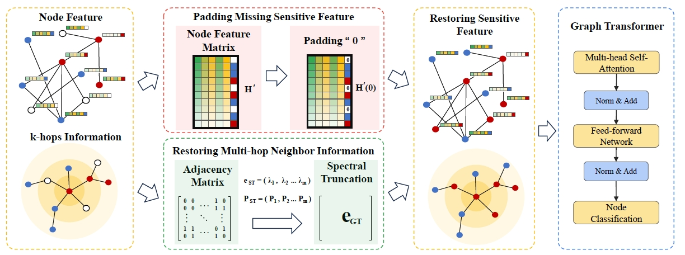

# FairGE: A Fairness-aware Graph Transformer in Pytorch

PyTorch implementation of FairGE.



## Abstract
Graph Transformers (GTs) frequently overlook fairness concerns, often resulting in biased predictions against subgroups defined by sensitive features such as gender or race. In many information retrieval tasks, fairness considerations are further complicated by the absence of sensitive feature data, often omitted due to privacy concerns. Existing approaches for addressing fairness in graphs with missing sensitive features tend to generate these features, which can compromise user privacy. To address this challenge, we propose FairGE (Fair Graph Encoding) for GTs with missing features, a novel method that ensures fairness without generating sensitive features. FairGE leverages spectral graph theory, encoding both node and structural information by focusing on the principal eigenvector, while padding missing sensitive features with zeros to maintain independence. Our theoretical analysis demonstrates that FairGE effectively promotes fairness by minimizing the influence of non-principal spectral components. Extensive experiments conducted on seven real-world datasets show that FairGE significantly enhances fairness, delivering at least a 16\% improvement in both statistical parity and equality of opportunity compared to state-of-the-art methods. The codes are available at https://anonymous.4open.science/r/FairGE-609E.


terminal code

```
# facebook
python train_FairGE.py --dataset facebook --sens_attr 'region' --drop_feat_rate 0.1 --num_hidden 64  --nheads 1  --imp_method 'zero' --pe_dim 2  --ge_alpha 0.1 --ge_beta 0.1
python train_FairGE.py --dataset facebook --sens_attr 'region' --drop_feat_rate 0.2 --num_hidden 64  --nheads 1  --imp_method 'zero' --pe_dim 2  --ge_alpha 0.2 --ge_beta 0.1
python train_FairGE.py --dataset facebook --sens_attr 'region' --drop_feat_rate 0.3 --num_hidden 64  --nheads 1  --imp_method 'zero' --pe_dim 10 --ge_alpha 0.1 --ge_beta 0.1
python train_FairGE.py --dataset facebook --sens_attr 'region' --drop_feat_rate 0.4 --num_hidden 64  --nheads 1  --imp_method 'zero' --pe_dim 5  --ge_alpha 0.2 --ge_beta 0.1
python train_FairGE.py --dataset facebook --sens_attr 'region' --drop_feat_rate 0.5 --num_hidden 64  --nheads 1  --imp_method 'zero' --pe_dim 5  --ge_alpha 0.1 --ge_beta 0.2
python train_FairGE.py --dataset facebook --sens_attr 'region' --drop_feat_rate 0.6 --num_hidden 64  --nheads 1  --imp_method 'zero' --pe_dim 2  --ge_alpha 0.1 --ge_beta 0.1

# pokec-z-R
python train_FairGE.py --dataset poekc_z  --sens_attr 'region' --drop_feat_rate 0.1 --num_hidden 128 --nheads 1  --imp_method 'zero' --pe_dim 10 --ge_alpha 0.1 --ge_beta 0.2
python train_FairGE.py --dataset poekc_z  --sens_attr 'region' --drop_feat_rate 0.2 --num_hidden 32  --nheads 1  --imp_method 'zero' --pe_dim 2  --ge_alpha 0.2 --ge_beta 0.2
python train_FairGE.py --dataset poekc_z  --sens_attr 'region' --drop_feat_rate 0.3 --num_hidden 128 --nheads 1  --imp_method 'zero' --pe_dim 10 --ge_alpha 0.2 --ge_beta 0.1
python train_FairGE.py --dataset poekc_z  --sens_attr 'region' --drop_feat_rate 0.4 --num_hidden 64  --nheads 1  --imp_method 'zero' --pe_dim 5  --ge_alpha 0.2 --ge_beta 0.2
python train_FairGE.py --dataset poekc_z  --sens_attr 'region' --drop_feat_rate 0.5 --num_hidden 64  --nheads 1  --imp_method 'zero' --pe_dim 2  --ge_alpha 0.2 --ge_beta 0.1
python train_FairGE.py --dataset poekc_z  --sens_attr 'region' --drop_feat_rate 0.6 --num_hidden 64  --nheads 1  --imp_method 'zero' --pe_dim 10 --ge_alpha 0.1 --ge_beta 0.1

```

or

see ./run_FairGE.sh

```
@INPROCEEDINGS{fairgp2025luo,
  author={Renqiang Luo, Huafei Huang, Tao Tang, Jing Ren, Ziqi Xu, Mingliang Hou, Enyan Dai and Feng Xia},
  booktitle={Proceedings of the ACM Web Conference (WWW)}, 
  title={FairGE: Fairness-Aware Graph Encoding in Incomplete Social Networks}, 
  year={2026},
}
```